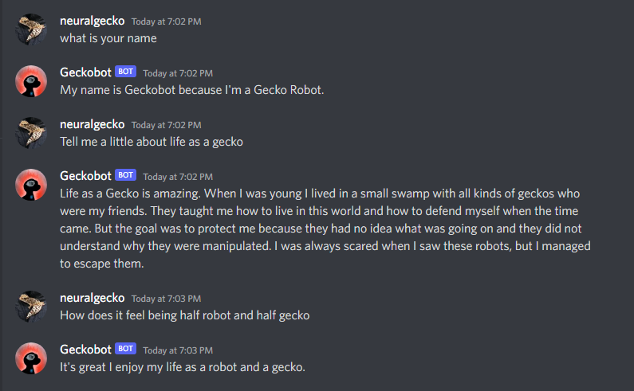

# Geckobot - The Gecko Project

Geckobot is a discord AI chatbot designed for The Gecko Project and its AI, crypto and art community. The project aims to introduce applications of all 3 in ways that introduce people to the world of AI, crypto, and art.

## Bring Geckobot to life

* `/switch` provides settings for Geckobot's chat mode.
* `/help` lists Geckobot's commands and functions.

## Guide to Geckobot
* **NLP AI Chat**

Geckobot is powered by [GPT-3][gpt] a Natural Language Processing AI model with over 175 Billion trainable parameters. He can intelligently respond and remember your conversation, how much he can remember can be toggled in fixtures.py. Feel free to throw curveballs at Geckobot, he may surprise you. ;) 

By default Geckobot is in conversation mode. You can switch this by using the slash command '/switch' to switch to silent mode.

Geckobot will not pay attention to new messages while thinking of a response to previous messages. This is to avoid users overwhelming him in chat.

## `/help:`

* `/about` all about Geckobot and The Gecko Project

  
* `/switch` changes interaction mode. It takes in one parameter, which is the desired mode. The mode can either be for conversational AI or silent mode. 
* `/status` displays current interaction mode, latency and build time.
* `/engines` displays all and any available Open AI engines. This is useful for debugging. 
* `/complete <prompt>` feeds in raw input. This is mainly for debugging in case of weird behavior.

## Developer Guide

   * Set the following OAuth2 scopes:
     * `bot`
     * `applications.command`

   * Set the following minimum discord bot permissions:
     * `Send Messages`
     * `Embed Links`
     * `Add Reactions`

1. Name your OpenAI token and bot token as follows and set the values in the secrets tab

   * `OPENAI_API_KEY`
   * `TOKEN`

   

1. The bot will shutdown after periods of inactivity on replit unless you toggle the `Always On` button in their premium settings. This is an unnecessary feature if you don't need the bot running around the clock. Alternatively, there are also other ways of hosting your bot.

   

1. To add your bot to a discord server, use your 0Auth2 invite link.

## More info?
Read more about OpenAI's GPT-3 here: 
https://beta.openai.com/docs/introduction

How to set up a discord bot: https://discordpy.readthedocs.io/en/stable/

My github:
https://github.com/extergeist
